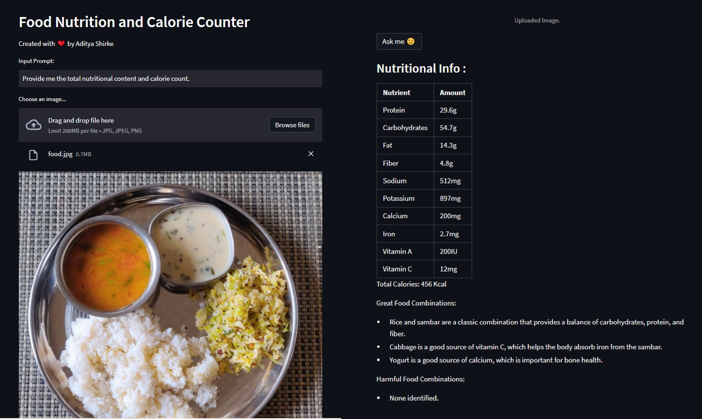
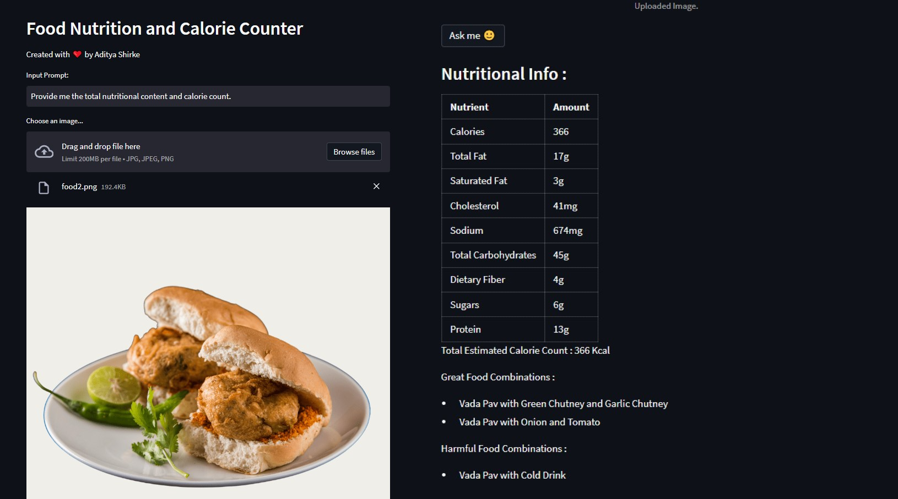

# Food Nutrition and Calorie Counter with Gemini PRO-vision Model

This repository utilizes the Gemini PRO-vision model to analyze meal images and provide users with detailed nutritional information, calorie count, and suggested food combinations. The interface is built using Streamlit, offering a user-friendly experience for uploading meal images and viewing the model's inferences.

## Features

- **Image Upload**: Users can upload images of their meals through the Streamlit interface.
- **Nutritional Analysis**: Gemini PRO-vision model performs inference to calculate the total nutritional content.
- **Calorie Count**: The system provides an accurate calorie count for the uploaded meal.
- **Food Combinations**: Users receive suggestions for well-balanced food combinations based on the analyzed meal.

## Example Screenshots

Example 1 :-


Example 2 :-


Example 3 :-


## Getting Started

### Prerequisites

- Python 3.10
- Install required Python packages:

### Requirements

The application requires the following dependencies:

- streamlit
- google-generativeai
- PIL (Python Imaging Library)
- python-dotenv

  ```bash
  pip install -r requirements.txt

Feel free to customize and extend the application based on your specific requirements.

